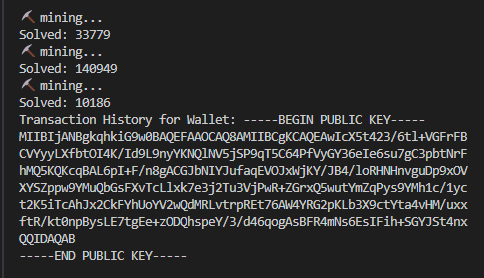

# simple_blockchain

- Built with node and typescript on top of
- [FireShip Blockchain](https://youtu.be/qF7dkrce-mQ) video

- Added transactiion history for wallet

```
// stores transaction
public transactionHistory: Transaction[] = [];

// adds the transaction whem money sent
this.transactionHistory.push(transaction);
```

`npm i` to to install node modules
`npm start` to run

### Results


